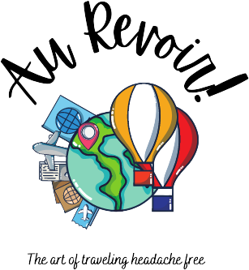

# Au Revoir 

This is my final project Au Revoir. This is a web application that provides the users with the ability to plan their trip from begining to end. It stores information of all their reservations (flights, hotels, restaurants, etc), saves their previous trips and allows them to repeat their favorite experiences. 

The front end of the application can be found in the `client` folder, while the back end is located in the `api` folder. 

