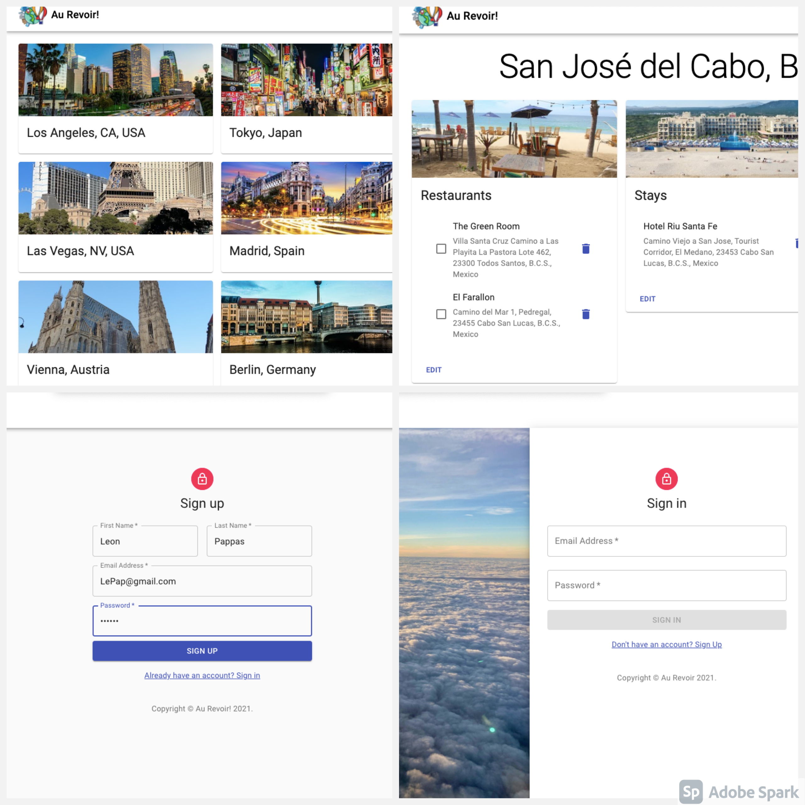

# Au Revoir

## App Description

A demo of this app is available [here](https://au-revoir.herokuapp.com/).

Welcome to Au Revoir. This is a web application that provides the users with the ability to plan their trip from begining to end. It stores information based on their input (flights, hotels, restaurants, etc), and lets them save it for future reference. An interesting feature of the app is that it gives them the option to select and mark the places that they have already visited. The user can save many trips at a time and revisit them as needed.

## Development Setup

1. Run `npm install`
2. Run `npm start`
